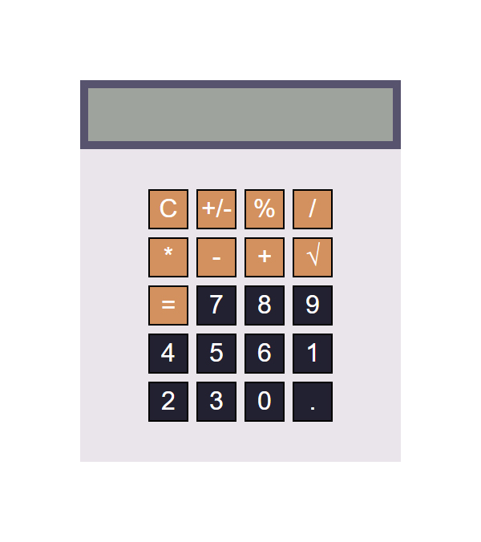

# Калькулятор на чистом JavaScript

[Cсылка на демо](https://eduardvorsin.github.io/my-portfolio/pet-projects/Calculator/index.html)

Принцип работы калькулятора:
- Числа записываются в значение `input'a` посредством ввода значений через кнопки или клавиатуры
- При нажатии кнопок `%`,`√` - сразу производится вычисление результатов данных операций
- При нажатии кнопок `+`,`-`,`/`,`*` в массив `operations` добавляется число и тип математической операции над числом
- При нажатии на символ `=` в `operations` добавляется последнее введенное число и происходит вычисление в функции `evaluate()`- внутри `evaluate()` пробегаемся циклом по `operations` вытаскивая 1-ые 3 значения, вычисляя результат выражения, и добавляя результат в начало `operations`. После того как в массиве будет меньше 2 чисел мы просто очищаем массив операций.
- Проблема неточности вычислений с дробными числами решается посредством функции `convertToPrecision()`, которая умножает число до целого, округляет по правилам округления и обратно делит до необходимого разряда

