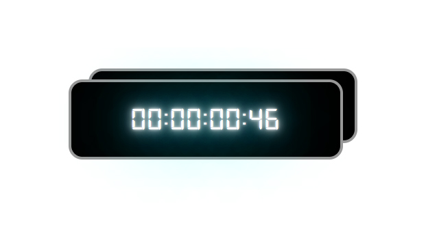

# Плагин таймера обратного отсчета на чистом JavaScript
[Cсылка на демо](https://eduardvorsin.github.io/my-portfolio/pet-projects/CountdownTimer/index.html)




Простой скрипт таймера обратного отсчета

## Разметка
```html
<div class="timer timer1">
  <time class="timer__time" data-timer-counter>00:00:00:00</time>
</div>
```
Выше показана довольная короткая разметка но минимально необходимая для правильности работы скрипта
### Необходимые `Data-атрибуты`

- `data-timer-counter` - атрибут который нужно поставить счетчику, для нахождения этого элемента внутри контейнера

## Стили
```css
.timer {
  display: block;
  max-width: 400px;
  width: 100%;
  padding: 20px;
  border-radius: 20px;
  background-color: rgb(0, 0, 0);
  border: 4px solid rgb(152, 152, 152);
  display: flex;
  align-items: center;
  justify-content: center;
  font-family: "digital-7";
  color: #fff;
  text-shadow:
    0 0 7px #fff,
    0 0 10px #fff,
    0 0 21px #fff,
    0 0 42px #00d9ff,
    0 0 82px #00d9ff,
    0 0 102px #00d9ff,
    0 0 151px #00d9ff;
  position: relative;
  animation: pulsate 2.5s infinite alternate;
}

.timer::before {
  content: '';
  position: absolute;
  max-width: 400px;
  width: 100%;
  background-color: rgb(0, 0, 0);
  border: 4px solid rgb(152, 152, 152);
  height: 100%;
  border-radius: 20px;
  z-index: -1;
  right: -25px;
  top: -20px;
}

.timer__time {
  font-size: 46px;
  letter-spacing: 2px;
}


@keyframes pulsate {
  100% {
    text-shadow:
      0 0 4px #fff,
      0 0 11px #fff,
      0 0 19px #fff,
      0 0 40px #00d9ff,
      0 0 80px #00d9ff,
      0 0 100px #00d9ff,
      0 0 150px #00d9ff;
  }

  0% {
    text-shadow:
      0 0 2px #fff,
      0 0 4px #fff,
      0 0 6px #fff,
      0 0 10px #00d9ff,
      0 0 45px #00d9ff,
      0 0 70px #00d9ff,
      0 0 80px #00d9ff;
  }
}

```
Просто презентационные стили, ваши стили могут быть совершенно другими.

## Cкрипты
### CountdownTimer.js
```javascript
'use strict';

class CountdownTimer {
  constructor(selector, options = {}) {

    this._timerContainer = document.querySelector(selector);

    if (this._timerContainer === null) {
      throw new Error(`The element with the ${selector} selector was not found`);
    }

    this._timerCounter = this._timerContainer.querySelector('[data-timer-counter]');

    if (this._timerCounter === null) {
      throw new Error(`The element with the [data-timer-counter] attribute was not found`);
    }

    this._options = options;
    this._timer = null;

    if (!this._options.futureDate) {
      this._futureDate = new Date(Date.now() + 60 * 1000);

    } else {
      this._futureDate = new Date(Date.parse(this._options.futureDate));
    }

    if (Number.isNaN(this._futureDate)) {
      throw new Error('Incorrect date format in the futureDate field');
    }

    this.setTime(this.#getRemainingTime());
    this.start();
  }

  #stringifyTime(value) {
    let days = Math.floor(value / 24 / 3600 / 1000);
    let hours = Math.floor((value / 3600 / 1000) % 24);
    let mins = Math.floor((value / 60 / 1000) % 60);
    let secs = Math.floor((value / 1000) % 60);

    days = days < 10 ? `0${days}` : days;
    hours = hours < 10 ? `0${hours}` : hours;
    mins = mins < 10 ? `0${mins}` : mins;
    secs = secs < 10 ? `0${secs}` : secs;

    return `${days}:${hours}:${mins}:${secs}`;
  }

  setTime(value) {
    if (this.isTimeOver()) {
      this._timerCounter.textContent = this.#stringifyTime(0);
      return;
    }

    this._timerCounter.textContent = this.#stringifyTime(value);
  }

  isTimeOver() {
    return this.#getRemainingTime() <= 0;
  }

  #getRemainingTime() {
    return this._futureDate.getTime() - Date.now();
  }

  start() {
    let prevTime = Math.trunc(this.#getRemainingTime() / 1000);

    this._options.onStart?.call(undefined, this._timerContainer, this._timerCounter);

    this._timer = requestAnimationFrame(function timeout() {
      let currentTime = Math.trunc(this.#getRemainingTime() / 1000);

      this.setTime(this.#getRemainingTime());

      if (prevTime > currentTime) {
        prevTime = currentTime;

        this._options.onUpdate?.call(undefined, this._timerContainer, this._timerCounter);
      }

      if (!this.isTimeOver()) {
        this._timer = requestAnimationFrame(timeout.bind(this));
      }

    }.bind(this));
  }

  reset() {
    this._options.onReset?.call(undefined, this._timerContainer, this._timerCounter);

    this.setTime(0);
    cancelAnimationFrame(this._timer);
  }
}

```
Кратко о методах класса:

- `#stringifyTime()` - метод который преобразует timestamp в строку
- `setTime(value)` - метод который устанавливает время в счетчике
- `isTimeOver()` - метод который возвращает true если время вышло
- `#getRemainingTime()` - метод который возращает оставшееся время
- `start()` - запускает работу таймера
- `reset()` - останавливает работу таймера и сбрасывает значение времени

Кратко о свойствах класса:

- `this._timerContainer` - контейнер таймера
- `this._timerCounter` - счетчик таймера который будет показывать обратный отсчет
- `this._options` - опции которые можно передать объектом в экземпляр класса
- `this._timer` - свойство в котором будет хранится таймер
- `this._futureDate` - свойство принимающее строку даты до которой нужно вести отсчет

### Инициализация экземпляра таймера обратного отсчета
```javascript
'use strict';

const timer1 = new CountdownTimer('.timer1', {
  futureDate: `${new Date(Date.now() + 1000 * 60)}`,

  onStart: function (timerContainer, timerCounter) {
    console.log('start');
  },

  onStop: function (timerContainer, timerCounter) {
    console.log('stop');
  },

  onUpdate: function (timerContainer, timerCounter) {
    console.log('update')
  },
```
Если параметр futureDate не задан то таймер заводится на 1 минуту.

При инициализации нового таймера обратного отсчета мы можем передать callback'и:
- `onStart()` - срабатывает при вызове метода start().
- `onReset()` - аналогично, срабатывает при вызове метода reset().
- `onUpdate()` - срабатывает на каждое обновление времени таймера.

В эти коллбеки можно передать 2 параметра: `timerContainer` и `timerCounter`, 1-ый для получения контейнера таймера и 2-ой для счетчика таймера.

При желании можно модифицировать скрипт чтобы время выводилось не в один элемент а несколько, например в элемент для даты, часов, минут, секунд. Также можно добавить какую нибудь анимацию через css или js.
