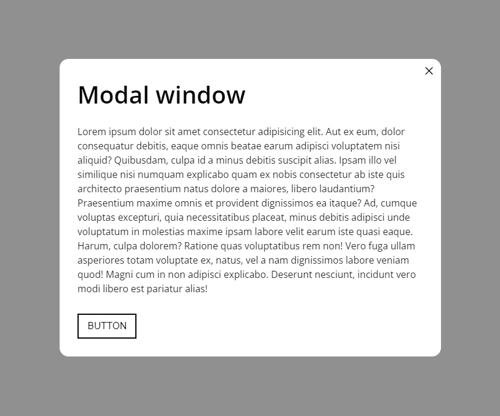

# Плагин модального окна на чистом JavaScript
[Cсылка на демо]()




Простой скрипт модального окна

## Разметка
```
<button class="btn" data-modalId="0" aria-expanded="false">
    open modal
  </button>
  <div class="modal" role="dialog" data-modalId="0" aria-hidden="true" aria-modal="true" aria-labelledby="modal-title">
    <div class="modal__container" data-modal-window>
      <button class="modal__close" data-modal-close aria-label="close modal window">
        
      </button>
      <h2 id="modal-title" class="modal__title">Modal window</h2>
      <div class="modal__text">
      </div>
      <button class="modal__btn btn">button</button>
    </div>
  </div>
```
Выше показана минимально необходимая разметка для правильности работы скрипта
### Необходимые `Data`-атрибуты

-  `data-modalId` - идентификатор модального окна, причем его нужно задавать как самому модальному окну так и кнопке при клике на которую должно открываться это окно.
-  `data-modal-window` - дата атрибут по которому находиться тело модального окна.
-  `data-modal-close` - дата атрибут по которому находиться кнопка по которой можно закрыть модальное окно

## Стили
```
._scroll-lock {
  overflow: hidden;
}

.modal {
  position: fixed;
  top: 0;
  left: 0;
  right: 0;
  bottom: 0;
  z-index: 100;
  overflow-y: auto;
  overflow-x: hidden;
  display: grid;
  align-items: center;
  justify-items: center;
  visibility: hidden;
  opacity: 0;
  transition: visibility 0.3s linear, opacity 0.3s linear;
}

.modal::before {
  content: '';
  position: fixed;
  width: 100%;
  height: 100%;
  top: 0;
  left: 0;
  background-color: hsla(0, 0%, 13%, 0.5);
  z-index: -1;
}

.modal__container {
  position: relative;
  max-width: 640px;
  width: 100%;
  padding: 30px 30px;
  margin: 30px 0px;
  background-color: hsl(0, 0%, 100%);
  border-radius: 15px;
}

.modal__close {
  cursor: pointer;
  background-color: transparent;
  border: none;
  position: absolute;
  top: 10px;
  right: 10px;
  z-index: 100;
}

.modal__close-icon {
  width: 20px;
  height: 20px;
  object-fit: cover;
  pointer-events: none;
}

.modal__title {
  font-size: 40px;
  margin-bottom: 20px;
  font-weight: 600;
}

.modal__text {
  font-size: 16px;
  color: hsl(0, 0%, 13%);
  overflow-y: auto;
  overflow-x: hidden;
  margin-bottom: 30px;
}

.modal._open {
  visibility: visible;
  opacity: 1;
  transition: visibility 0.3s linear, opacity 0.3s linear;
}

@keyframes slide-in-top {
  0% {
    transform: translateY(-1000px);
    opacity: 0;
  }

  100% {
    transform: translateY(0);
    opacity: 1;
  }
}

@keyframes slide-out-top {
  0% {
    transform: translateY(0);
    opacity: 1;
  }

  100% {
    transform: translateY(-1000px);
    opacity: 0;
  }
}

.slide-in-top {
  animation: slide-in-top 0.5s cubic-bezier(0.25, 0.46, 0.45, 0.94) both;
}

.slide-out-top {
  animation: slide-out-top 0.5s cubic-bezier(0.55, 0.085, 0.68, 0.53) both;
}

```
Основные необходимые стили лежат в `.modal, .modal__container, ._scroll-lock`.

## Cкрипты
### modal.js
```
'use strict';

class Modal {
  #scrollWidth = window.innerWidth - document.body.offsetWidth;
  #fixBlocks = document.querySelectorAll('._modal-fix');

  constructor(id, options = {
    closeClickingOnOverlay: true,
    onOpen: function (modalWindow, modal) { },
    onClose: function (modalWindow, modal) { },
  }) {

    this._options = options;
    this._modal = document.querySelector(`div[data-modalId="${id}"]`);
    if (this._modal === null) {
      throw new Error(`The element with the [data-modalId="${id}"] was not found`);
    }

    this._modalWindow = this._modal.querySelector('[data-modal-window]');
    if (this._modalWindow === null) {
      throw new Error(`The element with the [data-modal] was not found`);
    }

    this._close = this._modal.querySelector('[data-modal-close]');
    if (this._close === null) {
      throw new Error(`The element with the [data-modal-close] was not found`);
    }

    this._trigger = document.querySelector(
      `a[data-modalId="${id}"],
      button[data-modalId="${id}"]`,
    );
    if (this._trigger === null) {
      throw new Error(`The link or button with the [data-modalId] was not found`);
    }

    this._focusabeElements = [...this._modal.querySelectorAll(
      `a[href],
      button,
      input,
      textarea,
      select,
      [tabindex]`
    )];

    this._isOpen = false;

    this.closeClickingOnOverlay =
      this._options.closeClickingOnOverlay ?? true;

    this.#addEvents();
  }

  #addEvents() {
    document.addEventListener('click', (e) => {

      if (e.target === this._trigger) {
        e.preventDefault();
        this.open();
      }

      if (e.target === this._close || e.target === this._modal && this.closeClickingOnOverlay) {
        this.close();
      }
    });

    this._modal.addEventListener('keydown', (e) => {
      if (e.key === 'Tab') this.#changeFocus(e);

      if (this.isOpen && e.key === 'Escape') this.close();
    });
  }

  get isOpen() {
    return this._isOpen;
  }

  set isOpen(value) {
    this._isOpen = value;
  }

  open() {
    this.isOpen = true;
    this._modal.classList.add('_open');
    this._modal.setAttribute('aria-hidden', false);
    this._trigger.setAttribute('aria-expanded', true);
    this.#toggleScroll();
    this.#removeShift();
    setTimeout(() => this._close.focus(), 50);

    this._options.onOpen?.call(undefined, this._modalWindow, this._modal);

  }

  close() {
    this.isOpen = false;
    this._modal.classList.remove('_open');
    this._modal.setAttribute('aria-hidden', true);
    this._trigger.setAttribute('aria-expanded', false);
    this.#toggleScroll();
    this.#removeShift();

    this._options.onClose?.call(undefined, this._modalWindow, this._modal);

    this._trigger.focus();
  }

  #toggleScroll() {
    if (this.isOpen) {
      document.body.classList.add('_scroll-lock');
      return;
    }

    document.body.classList.remove('_scroll-lock');
  }

  #removeShift() {
    if (this.isOpen) {
      this._modal.style.paddingRight = `${this.#scrollWidth}px`;
      document.body.style.paddingRight = `${this.#scrollWidth}px`;
      this.#fixBlocks.forEach((elem) => {
        return elem.style.paddingRight = `${this.#scrollWidth}px`
      });
      return;
    }

    this._modal.style.paddingRight = `0px`;
    document.body.style.paddingRight = `0px`;
    this.#fixBlocks.forEach((elem) => elem.style.paddingRight = `0px`);
  }

  #changeFocus(e) {
    let focusedIndex = this._focusabeElements.indexOf(document.activeElement);

    if (e.shiftKey && focusedIndex === 0) {
      this._focusabeElements[this._focusabeElements.length - 1].focus();
      e.preventDefault();
    }

    if (!e.shiftKey && focusedIndex === this._focusabeElements.length - 1) {
      this._focusabeElements[0].focus();
      e.preventDefault();
    }
  }
}

```
Кратко о методах класса:

- `#addEvents()` - добавляет события при инициализации
- `open(), close()` - открывает/закрывает модальное окно
- `isOpen()` - возвращает/назначает состояние модального окна
- `#removeShift()` - убирает сдвиги модального окна при открытии/закрытии
- `#toggleScroll()` - удаляет/добавляет вертикальный скроллбар
- `#changeFocus()` - меняет фокус внутри модального окна
### Инициализация экземпляра модального окна
```
'use strict';

let modal0 = new Modal('0', {
  closeClickingOnOverlay: false,
  onOpen: (modalWindow, modal) => {
    modalWindow.classList.remove('slide-out-top');
    modalWindow.classList.add('slide-in-top');
  },
  onClose: (modalWindow, modal) => {
    modalWindow.classList.remove('slide-in-top');
    modalWindow.classList.add('slide-out-top');
  },
});
```
При инициализации нового модального окна мы можем передать callback'и `onOpen(), onClose()` - которые срабатывают при открытии/закрытии модального окна.
В качестве параметров передаются dom элемент модального окна и оверлея.
Особенности плагина:

- Модальное окно закрывается при нажатии клавиши escape или при клике на оверлей(если флаг closeClickingOnOverlay не поставлен в значение false).
- Если у вас есть элементы которые вызывают сдвиги при добавлении модального окна(например фиксированная шапка) попробуйте добавить класс _modal-fix.
- Возможность добавления своих кастомных анимаций или открытии/закрытии посредством добавления кода в методы onOpen(), onClose().

Особенностей у плагина не так много потому что целью было реализовать минимально необходимый функционал.
