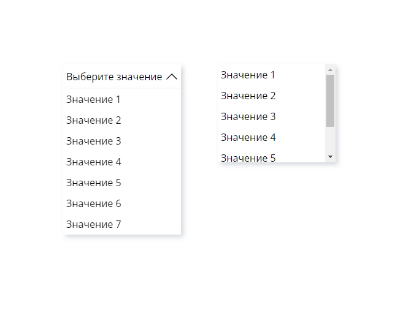

# Плагин селекта на чистом JavaScript
[Cсылка на демо]()



Простой скрипт селекта

## Разметка
```
  <div id="select-1" class="select-wrapper">
    <select class="select-wrapper__native-select native-select" name="select" data-select-native>
      <option class="native-select__option" value="value1">Значение 1</option>
      <option class="native-select__option" value="value2">Значение 2</option>
      <option class="native-select__option" value="value3">Значение 3</option>
      <option class="native-select__option" value="value4">Значение 4</option>
      <option class="native-select__option" value="value5">Значение 5</option>
      <option class="native-select__option" value="value6">Значение 6</option>
      <option class="native-select__option" value="value7">Значение 7</option>
    </select>
    <div class="select-wrapper__custom-select custom-select" data-select-custom>
      <button class="custom-select__trigger" data-select-trigger>
        Выберите значение
      </button>
      <ul class="custom-select__options" data-select-list>
        <li class="custom-select__option" data-select-option>Значение 1</li>
        <li class="custom-select__option" data-select-option>Значение 2</li>
        <li class="custom-select__option" data-select-option>Значение 3</li>
        <li class="custom-select__option" data-select-option>Значение 4</li>
        <li class="custom-select__option" data-select-option>Значение 5</li>
        <li class="custom-select__option" data-select-option>Значение 6</li>
        <li class="custom-select__option" data-select-option>Значение 7</li>
      </ul>
    </div>
  </div>

  <div id="select-2" class="select-wrapper">
    <select class="select-wrapper__native-select native-select" name="select" multiple data-select-native>
      <option class="native-select__option" value="value1">Значение 1</option>
      <option class="native-select__option" value="value2">Значение 2</option>
      <option class="native-select__option" value="value3">Значение 3</option>
      <option class="native-select__option" value="value4">Значение 4</option>
      <option class="native-select__option" value="value5">Значение 5</option>
      <option class="native-select__option" value="value6">Значение 6</option>
      <option class="native-select__option" value="value7">Значение 7</option>
    </select>

    <div class="select-wrapper__custom-select custom-select" data-select-custom>
      <ul class="custom-select__options" data-select-list>
        <li class="custom-select__option" data-select-option>Значение 1</li>
        <li class="custom-select__option" data-select-option>Значение 2</li>
        <li class="custom-select__option" data-select-option>Значение 3</li>
        <li class="custom-select__option" data-select-option>Значение 4</li>
        <li class="custom-select__option" data-select-option>Значение 5</li>
        <li class="custom-select__option" data-select-option>Значение 6</li>
        <li class="custom-select__option" data-select-option>Значение 7</li>
      </ul>
    </div>
  </div>

```
Выше представлены две разметки для обычного(#select-1) и мультиселекта(#select-2)
### Необходимые `Data-атрибуты`

- `data-select-native` -  назначается нативному селект
- `data-select-open` - программно задается/убирается триггеру при открытии и закрытии селекта
- `data-select-trigger` - применяется триггер открытия/закрытия селекта
- `data-select-list` - назначается списку опций кастомного селекта
- `data-select-custom` - добавляется кастомному селекту
- ` data-select-option` - применяется к опция кастомного селекта
- `data-select` - программно задается выбранной опции кастомного селекта
- `data-selected` - применяется для выбора опций по умолчанию в кастомном селекте

## Стили
```
.select-wrapper {
  position: relative;
  align-self: start;
}

.custom-select {
  position: absolute;
  top: 0;
  left: 0;
  display: none;
}

.custom-select__trigger,
.custom-select__options,
.custom-select[data-multiple] {
  box-shadow: 4px 4px 8px 0px hsla(206, 40%, 22%, 0.2);
}

@media (min-width: 769px) and (hover: hover) {
  .custom-select {
    display: block;
  }

  .native-select,
  .native-select__option {
    box-shadow: 4px 4px 8px 0px hsla(206, 40%, 22%, 0.2);
  }

  .custom-select__trigger,
  .custom-select[data-multiple],
  .native-select[multiple]>.native-select__option {
    box-shadow: none;
  }
}

.custom-select__trigger {
  border: none;
  font-family: 'Open Sans', sans-serif;
  position: relative;
}

.custom-select__trigger::before {
  content: '';
  position: absolute;
  ;
  right: 5px;
  top: 50%;
  transform: translateY(-50%) rotate(0deg);
  background-image: url('../images/icons/arrow-down.svg');
  background-size: 20px;
  background-repeat: no-repeat;
  background-position: 0 0;
  transition: transform 0.3s ease;
  width: 20px;
  height: 20px;
}

.custom-select__trigger[data-select-open]::before {
  transform: translateY(-50%) rotate(180deg);
  transition: transform 0.3s ease;
}

.custom-select__options {
  background-color: var(--select-background);
}

.custom-select__option[data-select] {
  background-color: var(--select-selected-color);
}

.custom-select__option:hover {
  background-color: var(--select-hover-color);
}

.custom-select__option,
.custom-select__trigger,
.native-select,
.native-select__option {
  color: #000000;
  font-size: 1rem;
  cursor: pointer;
}

.custom-select__trigger,
.native-select {
  background-color: var(--select-background);
  text-overflow: ellipsis;
  overflow: hidden;
  white-space: nowrap;
  text-align: left;
  height: 2.5rem;
  padding: 5px 30px 5px 5px;
  width: 100%;
}

.custom-select[data-multiple]>.custom-select__options {
  border: none;
}

.native-select {
  font-family: 'Open Sans', sans-serif;
  -webkit-appearance: none;
  -moz-appearance: none;
  appearance: none;
  display: grid;
  position: relative;
  background-image: url("../images/icons/arrow-down.svg");
  background-size: 20px;
  background-repeat: no-repeat;
  background-position: calc(100% - 5px) center;
}

.native-select[multiple] {
  padding: 0;
  background-image: none;
  border: none;
}

.custom-select[data-multiple],
.native-select[multiple] {
  overflow-y: scroll;
  height: 10rem;
}

.custom-select__option,
.native-select[multiple]>.native-select__option {
  padding: 5px;
}

.native-select[multiple]>.native-select__option {
  min-height: 34px;
}

.custom-select,
.native-select {
  max-width: 12rem;
  width: 100%;
}

.slide-in-top {
  -webkit-animation: slide-in-top 0.5s cubic-bezier(0.25, 0.46, 0.45, 0.94) both;
  animation: slide-in-top 0.5s cubic-bezier(0.25, 0.46, 0.45, 0.94) both;
}

.slide-out-top {
  -webkit-animation: slide-out-top 0.5s cubic-bezier(0.55, 0.085, 0.68, 0.53) both;
  animation: slide-out-top 0.5s cubic-bezier(0.55, 0.085, 0.68, 0.53) both;
}

@-webkit-keyframes slide-in-top {
  0% {
    -webkit-transform: translateY(-400px);
    transform: translateY(-400px);
    opacity: 0;
  }

  100% {
    -webkit-transform: translateY(0);
    transform: translateY(0);
    opacity: 1;
  }
}

@keyframes slide-in-top {
  0% {
    -webkit-transform: translateY(-400px);
    transform: translateY(-400px);
    opacity: 0;
  }

  100% {
    -webkit-transform: translateY(0);
    transform: translateY(0);
    opacity: 1;
  }
}

@-webkit-keyframes slide-out-top {
  0% {
    -webkit-transform: translateY(0);
    transform: translateY(0);
    opacity: 1;
  }

  100% {
    -webkit-transform: translateY(-400px);
    transform: translateY(-400px);
    opacity: 0;
  }
}

@keyframes slide-out-top {
  0% {
    -webkit-transform: translateY(0);
    transform: translateY(0);
    opacity: 1;
  }

  100% {
    -webkit-transform: translateY(-400px);
    transform: translateY(-400px);
    opacity: 0;
  }
}

```
В основном представлены презентационные стили, ваши стили могут быть совершенно другими, за исключением медиа запроса `@media (min-width: 769px) and (hover: hover)` который нужен для корректной работы

## Cкрипты
### HybridSelect.js
#### class HybridSelect

```
'use strict';

class HybridSelect {
  _selectWrapper
  _customSelect;
  _customSelectList;
  _customSelectOptions;
  _nativeSelect;
  _nativeSelectOptions;

  constructor(selector) {

    this._selectWrapper = document.querySelector(selector);
    if (this._selectWrapper === null) {
      throw new Error(`The element with this selector(${selector}) was not found`);
    }

    this._customSelect = this._selectWrapper.querySelector('[data-select-custom]');
    if (this._customSelect === null) {
      throw new Error('The element with data-select-custom was not found');
    }

    this._customSelectList = this._customSelect.querySelector('[data-select-list]');
    if (this._customSelectList === null) {
      throw new Error('the element with data-select-list was not found');
    }

    this._customSelectOptions = [...this._customSelectList.children];
    if (this._customSelectOptions.length === 0) {
      throw new Error('Elements in data-select-list element were not found');
    }

    this._nativeSelect = this._selectWrapper.querySelector('[data-select-native]');
    if (this._nativeSelect === null) {
      throw new Error('The element with data-select-native was not found');
    }

    this._nativeSelectOptions = [...this._nativeSelect.children];
    if (this._nativeSelectOptions.length === 0) {
      throw new Error('Elements in data-select-native element were not found');
    }

    this._customSelect.setAttribute('aria-hidden', true);
    this._nativeSelect.tabIndex = -1;

    this._addEvents();
  }

  _addEvents() {
    this._customSelect.addEventListener('click', (e) => {
      this._clickHandler(e);
    });

    this._customSelect.addEventListener('keydown', (e) => {
      this._keyboardNavigation(e);
    });
  }

  set value(value) {
    let findedIndex = this._nativeSelectOptions.findIndex(option => {
      return option.value === value;
    });

    if (findedIndex < 0) return;
    this.selectOption(this._customSelectOptions[findedIndex]);
  }

  get selectedIndex() {
    return this._customSelectOptions.findIndex((option) => {
      return 'select' in option.dataset;
    });
  }

  set selectedIndex(value) {
    if ((typeof value !== 'number') && !Number.isInteger(value)) {
      throw new Error('selectedIndex must be a integer number');
    };

    if (value < 0 || value > this._customSelectOptions.length) {
      throw new Error('the index value cannot be less than 0 or greater than the last selection point');
    }

    this.selectOption(this._customSelectOptions[value]);
  }


  get selectedOptions() {
    return this._customSelectOptions.filter(option => {
      return 'select' in option.dataset;
    });
  }

  get options() {
    return {
      ...this._customSelectOptions,
      selectedIndex: this.selectedIndex,
      length: this._customSelectOptions.length,
    };
  }

  get value() {
    return this._nativeSelectOptions[this.selectedIndex].value;
  }

  _isValidKey(value) {
    let validKeys = [
      'ArrowDown',
      'ArrowUp',
      'ArrowLeft',
      'ArrowRight',
      'PageUp',
      'PageDown',
      'Home',
      'End',
      'Tab',
      'Escape',
      ' ',
      'Enter'];

    return validKeys.includes(value);
  }
}
```
#### class SingleSelect
```
class SingleSelect extends HybridSelect {
  isOpen;

  constructor(selector, settings = {
    onOpen: function (customSelectList) { },
    onClose: function (customSelectList) { },
    onSelect: function (customSelectOption) { },
  }) {
    super(selector);

    this.multiple = false;
    this._customSelectTrigger = this._customSelect.querySelector('[data-select-trigger]');

    if (this._customSelectTrigger === null) {
      throw new Error('The element with data-select-trigger was not found');
    }

    this._customSelectOptions.forEach(option => {
      if ('selected' in option.dataset) {
        this._selectOption(option);
      };
    });

    this._settings = settings;
    this.close();
  }

  open() {
    this.isOpen = true;
    this._customSelectTrigger.setAttribute('data-select-open', '');
    this._settings.onOpen?.call(undefined, this._customSelectList);
  }

  close() {
    this.isOpen = false;
    this._customSelectTrigger.removeAttribute('data-select-open');
    this._settings.onClose?.call(undefined, this._customSelectList);
  }

  toggle() {
    this.isOpen ? this.close() : this.open();
  }

  _selectOption(element) {
    this._customSelectOptions.forEach(option => {
      option.removeAttribute('data-select');
    });

    this._customSelectTrigger.textContent = element.textContent;
    element.setAttribute('data-select', '');
    this._syncronizeWithNative(element);
    this._settings.onSelect?.call(undefined, this._customSelectOptions[this.selectedIndex]);
  }

  _clickHandler(e) {
    if (e.target === this._customSelectTrigger) {
      this.toggle();
    }

    if (e.target.parentElement === this._customSelectList) {
      this._selectOption(e.target);
      this.close();
    }
  }

  _keyboardNavigation(e) {
    if (!super._isValidKey(e.key)) return;

    let index;
    let option;
    let firstIndex = 0;
    let lastIndex = this._customSelectOptions.length - 1;

    switch (e.key) {
      case 'ArrowDown':
      case 'ArrowRight':
        if (e.altKey) {
          this.toggle();
          return;
        };

        index = this.selectedIndex + 1;
        break;

      case 'ArrowUp':
      case 'ArrowLeft':
        if (e.altKey) {
          this.toggle();
          return;
        };

        index = this.selectedIndex - 1;
        break;

      case 'PageDown':
      case 'End':
        index = lastIndex;
        break;

      case 'PageUp':
      case 'Home':
        index = firstIndex;
        break;

      case 'Tab':
      case 'Escape':
        this.close();
        return;

      case ' ':
      case 'Enter':
        index = this.selectedIndex;
        break;
    }

    option = this._customSelectOptions[index];

    if (index < firstIndex || index > lastIndex) {
      return;
    }

    this._selectOption(option);
  }

  get value() {
    return super.value;
  }

  get selectedIndex() {
    return super.selectedIndex;
  }

  get selectedOptions() {
    return super.selectedOptions;
  }

  get options() {
    return super.options;
  }

  _syncronizeWithNative() {
    this._nativeSelect.selectedIndex = this.selectedIndex;
  }
}
```
#### class MultipleSelect
```
class MultipleSelect extends HybridSelect {
  constructor(selector, settings = {
    onSelect: function (customSelectOption) { },
  }) {
    super(selector);
    this.multiple = true;

    this._customSelectOptions.forEach(option => {
      if ('selected' in option.dataset) {
        this._selectOption(option);

      };

      option.tabIndex = 0;
    });

    this._settings = settings;
    this._customSelect.dataset.multiple = '';
  }

  _selectOption(element) {
    const isSelected = 'select' in element.dataset;

    if (isSelected) {
      element.removeAttribute('data-select');
    } else {
      element.setAttribute('data-select', '');
    }

    this._syncronizeWithNative(element);
    this._settings.onSelect?.call(undefined, this._customSelectOptions[this.selectedIndex]);
  }

  _clickHandler(e) {
    if (e.target.parentElement === this._customSelectList) {
      this._selectOption(e.target);
    }
  }

  _keyboardNavigation(e) {
    if (!super._isValidKey(e.key)) return;

    let index;
    let option;
    let firstIndex = 0;
    let lastIndex = this._customSelectOptions.length - 1;

    switch (e.key) {
      case 'ArrowDown':
      case 'ArrowRight':
        index = this.focusedIndex + 1;
        break;

      case 'ArrowUp':
      case 'ArrowLeft':
        index = this.focusedIndex - 1;
        break;

      case 'Tab':
        index = this.focusedIndex;
        break;

      case 'PageDown':
      case 'End':
        index = lastIndex;
        break;

      case 'PageUp':
      case 'Home':
        index = firstIndex;
        break;

      case ' ':
      case 'Enter':
        e.preventDefault();
        option = this._customSelectOptions[this.focusedIndex];
        this._selectOption(option);
        return;
    }

    if (index >= firstIndex && index <= lastIndex) {
      option = this._customSelectOptions[index];
      option.focus();
    }
  }

  get value() {
    return super.value;
  }

  get selectedIndex() {
    return super.selectedIndex;
  }

  get focusedIndex() {
    return this._customSelectOptions.findIndex((option) => {
      return document.activeElement === option;
    });
  }

  get selectedOptions() {
    return super.selectedOptions;
  }

  get options() {
    return super.options;
  }

  _syncronizeWithNative(option) {
    const findedIndex = this._customSelectOptions.indexOf(option);
    const isSelected = this._nativeSelectOptions[findedIndex].selected;
    this._nativeSelectOptions[findedIndex].selected = !isSelected;
  }
}

```
Кратко о классах их методах и свойствах:
В классе HybridSelect описаны общие методы и свойства для селекта.
Классы SingleSelect и MultipleSelect наследуют функционал от HybridSelect и добавляют свои свойства и методы.

Методы класса HybridSelect

- `_addEvents()` - добавляет обработчики событий
- `get value()` - получает значение атрибута value у выбранной опции
- `set value()` - выделяет опцию кастомного селекта с указанным значением для атрибута value
- `get selectedIndex()` - получает индекс выбранной опции
- `set selectedIndex()` - выбирает опцию по переданному индексу
- `get selectedOptions` - возвращает массив выбранных опций
- `get options()` - возвращает объект со всеми опциями, выбранной опцией и количеством опций

Свойства класса HybridSelect:

- `this._selectWrapper` - обертка для двух селектов
- `this._customSelect` - кастомный селект
- `this._customSelectList` - список опций кастомного селекта
- `this._customSelectOptions` - опции кастомного селекта
- `this._nativeSelect` - нативный селект
- `this._nativeSelectOptions` - опции нативного селекта

Методы класса SingleSelect

- `open()` - метод открытия селекта
- `close()` - метод закрытия селекта
- `toggle()` - переключает открытие и закрытие селекта
- `_selectOption(element)` - выбирает конкретную опцию
- `_clickHandler(e)` - Обработчик событий клика
- `_keyboardNavigation(e)` - Обрабатывает события клавиатуры и организует навигацию с помощью клавиатуры
- `_syncronizeWithNative` - синхронизирует выбор кастомного селекта с нативным

Свойства класса SingleSelect:

- `this.isOpen` - свойство для хранения состояния селекта
- `this._multiple` - свойство обозначающее является ли этот селект мульти селектом
- `this._customSelectTrigger` - кнопка открытия/закрытия селекта
- `this._settings` - опции для селекта

Методы класса MultipleSelect

Такие же как и у SingleSelect кроме:
- `open()/close()/toggle()` - которые отсутсвуют у MultipleSelect
- `get focusedIndex()` - получает индекс опции находящейся в состоянии фокуса

Свойства класса MultipleSelect:

Такие же как и у SingleSelect кроме:
- `this.isOpen, this._customSelectTrigger` - отсутсвуют у MultipleSelect

### Инициализация экземпляра селекта
```
'use strict';

const select = new SingleSelect('#select-1', {
  onOpen: function (customSelectList) {
    console.log('onOpen: ', customSelectList);
    customSelectList.classList.add('slide-in-top');
    customSelectList.classList.remove('slide-out-top');
  },
  onClose: function (customSelectList) {
    console.log('onClose: ', customSelectList);
    customSelectList.classList.add('slide-out-top');
    customSelectList.classList.remove('slide-in-top');
  },
  onSelect: function (customSelectOption) {
    console.log('onSelect: ', customSelectOption);
  }
});

const select2 = new MultipleSelect('#select-2', {
  onSelect: function (customSelectOption) {
    console.log('onSelect: ', customSelectOption);
  }
});
```
Особенности плагина:
- Этот селект является гибридным селектом, т.е на пк показывается кастомный селект, для скринридеров и телефонов нативный селект
- Выбор кастомного селекта синхронизируется с нативным селектом что позволяет в дальнейшем упростить валидацию и получение данных из селекта
- Поведение селекта максимально приближено к нативному(кроме режима мультиселекта для которого поведение было упрощено)
- Добавленны нативные геттеры(`value`, `selectedIndex`, `selectedOptions`, `options`) и сеттеры(`value`, `selectedIndex`)
- Реализована навигация по клавиатуре а именно:
- По стрелкам `вверх`,`вниз`,`влево`,`вправо` можно переключать выбранную опцию селекта(а в обычном селекте даже не открывая список опций). А с зажатой клавишой `Alt` закрывать и открывать селект(работает только для обычного селекта)
- `PgUp`,`PgDn`,`Home`,`End` - можно переключаться между первой и последней опцией
- `Space`,`Enter` - выбирать опцию селекта
- `Escape`,`Tab` - закрывать селект(только для обычного селекта)
- Также в опции можно передать коллбеки:
- `onOpen` - срабатывает при открытии селекта(только для обычного селекта)
- `onClose` - срабатывает при закрытии селекта(только для обычного селекта)
- `onSelect` - срабатывает при выборе опции селекта
