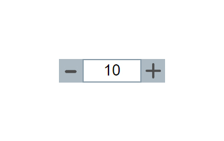

# Плагин степпера на чистом JavaScript
[Cсылка на демо](https://eduardvorsin.github.io/my-portfolio/pet-projects/Stepper/index.html)




Простой скрипт степпера

## Разметка
```html
  <div class="stepper">
    <label class="visually-hidden stepper__label" for="stepper">Stepper</label>
    <input class="stepper__input" id="stepper" type="text" inputmode="numeric" data-stepper-step="0.33"
      data-stepper-min="10" data-stepper-max="100" placeholder="number" pattern="\d" autocomplete="off">
    <div class="stepper__btns">
      <button class="stepper__btn stepper__increase" data-stepper-increase>
        increase
      </button>
      <button class="stepper__btn stepper__decrease" data-stepper-decrease>
        decrease
      </button>
    </div>
  </div>
```
Выше показана разметка минимально необходимая для правильности работы скрипта
### Необходимые `Data-атрибуты`

- `data-stepper-step` -  хранит в себе значение шага для степпера
- `data-stepper-min` - значение минимума для степпера
- `data-stepper-max` - значение максимума для степпера
- `data-stepper-increase` - кнопка для увеличения значения степпера
- `data-stepper-decrease` - кнопка для уменьшения значения степпера

## Стили
```css
.visually-hidden {
  position: absolute;
  width: 1px;
  height: 1px;
  margin: -1px;
  padding: 0;
  overflow: hidden;
  border: 0;
  clip: rect(0 0 0 0);
}

.stepper {
  display: grid;
  grid-template-columns: 40px 100px 40px;
  grid-template-rows: 40px;
}

.stepper__input,
.stepper__increase,
.stepper__decrease {
  background-color: transparent;
  border: 2px solid hsl(204, 16%, 60%);
}

.stepper__input {
  text-align: center;
  font-size: 26px;
  transition: border-color 0.3s ease;
}

.stepper__input::placeholder {
  font-size: 0;
}

.stepper__btn {
  position: relative;
  font-size: 0;
  background-color: hsl(204, 16%, 60%);
  cursor: pointer;
  padding: 2px;
  transition: background-color 0.3s ease, border-color 0.3s ease;
}

.stepper__input[read-only],
.stepper__btn {
  opacity: 0.7;
}

.stepper__btn::before {
  content: '';
  position: absolute;
  top: 0;
  left: 0;
  width: 100%;
  height: 100%;
  background-size: 30px;
  background-repeat: no-repeat;
  background-position: 50% 50%;
}

.stepper__increase::before {
  background-image: url(../images/icons/plus.svg);
}

.stepper__decrease::before {
  background-image: url(../images/icons/minus.svg);
}

.stepper__btn:hover {
  background-color: hsl(204, 16%, 70%);
  border-color: hsl(204, 16%, 70%);
  transition: background-color 0.3s ease, border-color 0.3s ease;
}

.stepper__btn:active {
  background-color: hsl(204, 16%, 80%);
  border-color: hsl(204, 16%, 80%);
  transition: background-color 0.3s ease, border-color 0.3s ease;
}

.stepper__input:hover {
  border-color: hsl(204, 16%, 70%);
  transition: border-color 0.3s ease;
}

```
Просто презентационные стили, ваши стили могут быть совершенно другими.

## Cкрипты
### Stepper.js
```javascript
'use strict';

class Stepper {
  constructor(selector) {
    this._stepperContainer = document.querySelector(selector);

    if (this._stepperContainer === null) {
      throw new Error(`An element with such a selector(${selector}) was not found`);
    }

    this._stepperInput = this._stepperContainer.querySelector('input');

    if (this._stepperInput === null) {
      throw new Error('The input field for the stepper was not found');
    }

    this._stepperIncreaseBtn = this._stepperContainer.querySelector('[data-stepper-increase]');

    if (this._stepperIncreaseBtn === null) {
      throw new Error('button with date attribute [data-stepper-increase] not found');
    }

    this._stepperDecreaseBtn = this._stepperContainer.querySelector('[data-stepper-decrease]');

    if (this._stepperDecreaseBtn === null) {
      throw new Error('button with date attribute [data-stepper-decrease] not found');
    }

    this._step = +this._stepperInput.dataset.stepperStep.trim() || 1;

    if ('stepperMin' in this._stepperInput.dataset) {
      this._min = +this._stepperInput.dataset.stepperMin;
      this._stepperInput.ariaValueMin = this._min;
    }

    if (!this.#isValidNumber(this._min)) {
      throw new Error('invalid minimum value for the stepper');
    }

    if ('stepperMax' in this._stepperInput.dataset) {
      this._max = +this._stepperInput.dataset.stepperMax;
      this._stepperInput.ariaValueMax = this._max;
    }

    if (!this.#isValidNumber(this._max)) {
      throw new Error('invalid maximum value for the stepper');
    }

    if (this.min > this.max) {
      throw new Error('The minimum cannot be greater than the maximum');
    }

    if (!Number.isInteger(this.step)) {
      this._numberPrecision = this.step.toString().split('.')[1].length;
    }

    if (this._stepperInput.readOnly) {
      this._stepperIncreaseBtn.disabled = true;
      this._stepperDecreaseBtn.disabled = true;
      return;
    }

    this.setValue(this._min);
    this.#addEvents();
  }

  increase() {
    let inputValue = +this._stepperInput.value;
    let nextValue = null;

    if (this.max !== undefined && inputValue >= this.max) {
      nextValue = this.max;
    }

    if (inputValue < this.min) {
      nextValue = this.min;
    }

    if (nextValue === null) {
      if (Number.isInteger(this.step)) {
        nextValue = inputValue + this.step;
      } else {
        nextValue = this.#convertToPrecision(inputValue + this.step, this._numberPrecision);
      }
    }

    this._stepperInput.value = nextValue;
    this._stepperInput.ariaValueNow = nextValue;
  }

  decrease() {
    let inputValue = +this._stepperInput.value;
    let nextValue = null;

    if (this.min !== undefined && inputValue <= this.min) {
      nextValue = this.min;
    }

    if (inputValue > this.max) {
      nextValue = this.max;
    }

    if (nextValue === null) {
      if (Number.isInteger(this.step)) {
        nextValue = inputValue - this.step;
      } else {
        nextValue = this.#convertToPrecision(inputValue - this.step, this._numberPrecision);
      }
    }

    this._stepperInput.value = nextValue;
    this._stepperInput.ariaValueNow = nextValue;
  }

  setValue(value) {

    if (!this.#isValidNumber(value)) {
      throw new Error('The value must be a numeric type');
    }

    if (value < this.min || value > this.max) {
      throw new Error('The passed value cannot be less then the minimum or greater than the maximum');
    }

    this._stepperInput.value = value;
    this._stepperInput.ariaValueNow = value;
  }

  #addEvents() {
    document.addEventListener('keydown', (e) => {
      if (!(e.target === this._stepperInput)) return;

      if (!this.#isValidKey(e.key)) {
        e.preventDefault();
        return false;
      }

      switch (e.key) {
        case 'ArrowUp':
          if (this.#isNextValueLessMaximum(e.target.value)) {
            this.increase();
          }
          break;
        case 'ArrowDown':
          if (this.#isNextValueMoreMinimum(e.target.value)) {
            this.decrease();
          }
          break;
        case 'Home':
          if (this.min !== undefined) this.setValue(this.min);
          break;
        case 'End':
          if (this.max !== undefined) this.setValue(this.max);
          break;
      }
    });

    document.addEventListener('click', (e) => {
      if (e.target === this._stepperIncreaseBtn) {
        if (this.#isNextValueLessMaximum(this._stepperInput.value)) {
          this.increase();
        }
      }

      if (e.target === this._stepperDecreaseBtn) {
        if (this.#isNextValueMoreMinimum(this._stepperInput.value)) {
          this.decrease();
        }
      }
    });
  }

  get min() {
    return this._min;
  }

  set min(value) {
    if (!this.#isValidNumber(value)) {
      throw new Error('invalid minimum value for the stepper');
    }

    if (this.#isValueEmptyString()) {
      this._stepperInput.removeAttribute('data-stepper-min');
      this._stepperInput.removeAttribute('aria-valuemin');
      delete this._min;
      return;
    }

    this._min = value;
    this._stepperInput.dataset.stepperMin = value;
    this._stepperInput.ariaValueMin = value;
    this._stepperInput.value = Math.max(this._stepperInput.value, value);
    this._stepperInput.ariaValueNow = Math.max(this._stepperInput.value, value);
  }

  get max() {
    return this._max;
  }

  set max(value) {
    if (!this.#isValidNumber(value)) {
      throw new Error('invalid maximum value for the stepper');
    }

    if (this.#isValueEmptyString()) {
      this._stepperInput.removeAttribute('data-stepper-max');
      this._stepperInput.removeAttribute('aria-valuemax');
      delete this._max;
      return;
    }

    this._max = value;
    this._stepperInput.dataset.stepperMax = value;
    this._stepperInput.ariaValueMax = value;
    this._stepperInput.value = Math.min(this._stepperInput.value, value);
    this._stepperInput.ariaValueNow = Math.min(this._stepperInput.value, value);
  }

  get step() {
    return this._step;
  }

  set step(value) {
    if (!this.#isValidNumber(value)) {
      throw new Error('invalid value for the step');
    }

    let nextValue = this.#isValueEmptyString() ? 1 : value;

    this._step = nextValue;
    this._stepperInput.dataset.stepperStep = nextValue;
    this._stepperInput.ariaValueNow = nextValue;
  }

  #convertToPrecision(num, precision) {
    return Math.round(num * 10 ** precision) / 10 ** precision;
  }

  #isValidNumber(value) {
    return !Number.isNaN(+value);
  }

  #isNextValueLessMaximum(value) {
    if (this.max === undefined) return true;

    let nextValue = Number(value) + this.step;
    return nextValue <= this.max;
  }

  #isNextValueMoreMinimum(value) {
    if (this.min === undefined) return true;

    let nextValue = Number(value) - this.step;
    return nextValue >= this.min;
  }

  #isValidKey(value) {
    let validKeys = ['0', '1', '2', '3', '4', '5', '6', '7', '8', '9', '0', 'ArrowRight', 'ArrowLeft', 'ArrowDown', 'ArrowUp', 'Delete', 'Backspace', 'Home', 'End', 'Tab'];

    return validKeys.includes(value);
  }

  #isValueEmptyString(value) {
    return typeof value === 'string' && value.trim() === '';
  }
}

```
Кратко о методах класса:

- `increase()` - увеличивает значение степпера на значение шага
- `decrease()` - уменьшает значение степпера на значение шага
- `setValue(value)` - устанавливает переданное значение степперу
- `#addEvents()` - добавляет события ввода, клика, нажатия клавиш
- `get min()` - геттер для получения минимального значения степпера
- `set min()` - сеттер для установки нового минимального значения степпера
- `get max()` - геттер для получения максимального значения степпера
- `set max()` - сеттер для установки нового максимального значения степпера
- `get step()` - геттер для получения значения шага
- `set step()` - сеттер для установки нового значения шага
- `#convertToPrecision(num, precision)` - преобразует и округляет число(`num`) до заданной точности(`precision`)
- `#isValidNumber()` - возвращает true если число не равно NaN
- `#isNextValueLessMaximum(value)` - возвращает true, если число(`value + step`) меньше максимума
- `#isNextValueMoreMinimum(value)` - возвращает true, если число(`value - step`) максимума
- `#isValidKey(value)` - возвращает true, если была нажата валидная клавиша
- `#isValueEmptyString(value)` - возвращает true, если значение является пустой строкой

Кратко о свойствах класса:

- `this._stepperContainer` - контейнер для степпера
- `this._stepperInput` - поле ввода степпера
- `this._stepperIncreaseBtn` - кнопка увеличения значения
- `this._stepperDecreaseBtn` - кнопка уменьшения значения
- `this._min` - минимальное значение внутри степпера
- `this._max` - максимальное значение внутри степпера
- `this._numberPrecision` - количество чисел после запятой, если шаг дробное число

### Инициализация экземпляра степпера
```javascript
'use strict';

const stepper = new Stepper('.stepper');
```
Особенности плагина:
- Функционал приближенный к нативному степперу, но с возможностью кастомной стилизации
- При добавлении инпуту атрибута readonly, делает степпер только для чтения(как и в браузерном)
