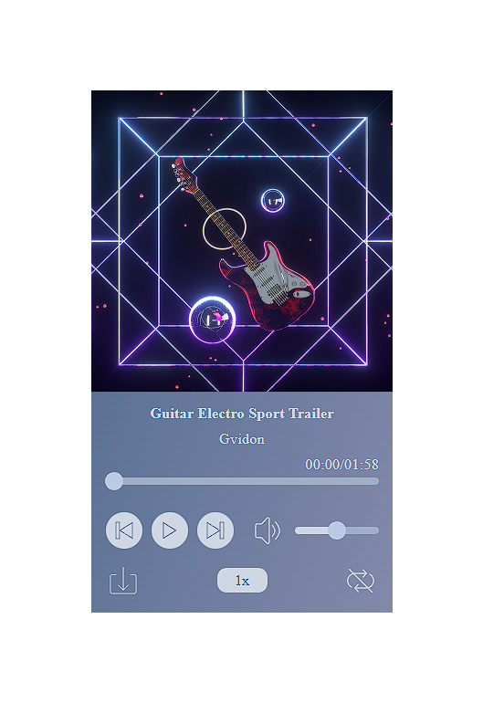

# 🎵 Аудио плеер
[Cсылка на демо](https://eduardvorsin.github.io/my-portfolio/pet-projects/audio-player/build/index.html)



## Технологии которые использовались при написании


## ⚙️ Использование
Пример как можно использовать компонент
```javascript
<AudioPlayer
	preload='metadata'
	src={tracks[trackIndex].src}
	trackName={tracks[trackIndex].trackName}
	trackArtist={tracks[trackIndex].trackArtist}
	sources={tracks[trackIndex].sources}
	showDownloadControl
	showPlaybackRateControl
	showLoopControl
	showNextAndPreviousControls
	onClickPrevious={handleClickPrevious}
	onClickNext={handleClickNext}
/>
```
## 📑 Пропсы
Ниже представлена таблица пропсов которые можно передать компоненту AudioPlayer
|            Пропс            |    Тип   | Дефолтное значение |                                    Описание                                   |
|:---------------------------:|:--------:|:------------------:|:-----------------------------------------------------------------------------:|
| src                         | string   |         ' '         | путь к аудио ресурсу                                                          |
| trackName                   | string   |         ' '         | название аудиозаписи                                                          |
| trackArtist                 | string   |         ' '         | название исполнителя                                                          |
| sources                     | array    |        [' ']        | массив путей к аудио ресурсам,  значения массива помещаются  в теги `<source>`  |
| showDownloadControl         | boolean  |        false       | показать кнопку скачивания трека                                              |
| showPlaybackRateControl     | boolean  |        false       | показать кнопку управления  скоростью аудиозаписи                             |
| showLoopControl             | boolean  |        false       | показать кнопку цикличности аудио                                             |
| showNextAndPreviousControls | boolean  |        false       | показать кнопки переключения треков                                           |
| onClickPrevious             | function |      ( ) => { }     | коллбек который срабатывает при клике на кнопку предыдущего трека             |
| onClickNext                 | function |      ( ) => { }     | коллбек который срабатывает при клике на кнопку следующего трека              |
## ✨ Особенности
### Доступны следущие функции плеера:
- Переключение треков
- Переключение беззвучного режима
- Скачивание текущего трека
- Возможно замедлить или ускорить проигрывание
- Циклично проигрывать текущую аудиозапись

### Для управления плеером с клавиатуры доступны следующие клавиши:
- `spaceBar`, `enter` - включить/выключить воспроизведение аудио
- `↑` - увеличить громкость
- `↓` -  понизить громкость
- `←` -  перемотать аудиозапись на 1 секунду назад
- `→` - перемотать аудиозапись на 1 секунду вперед
- `m` - переключение режима мута
- `l` - переключение режима цикличности
